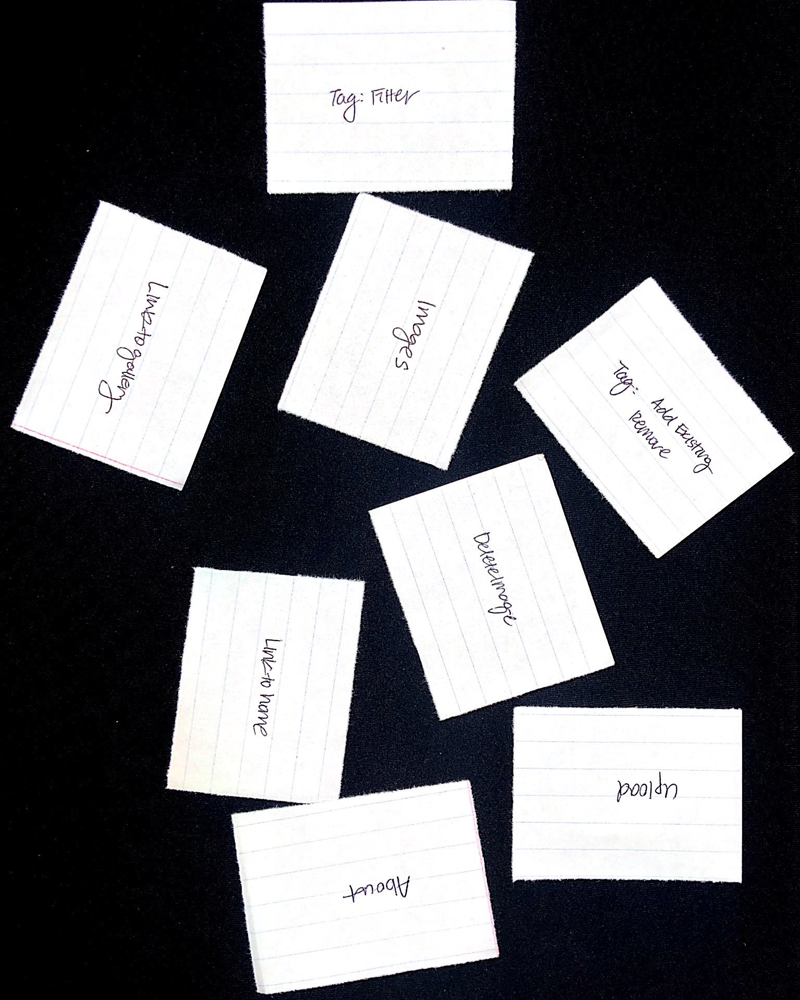
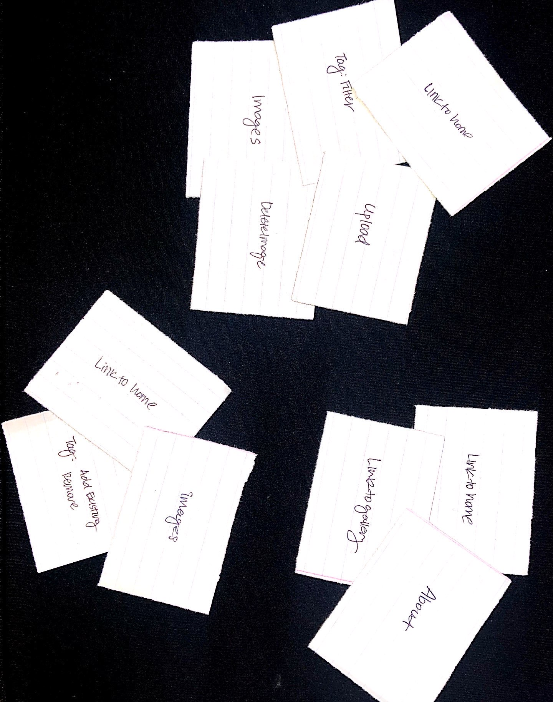
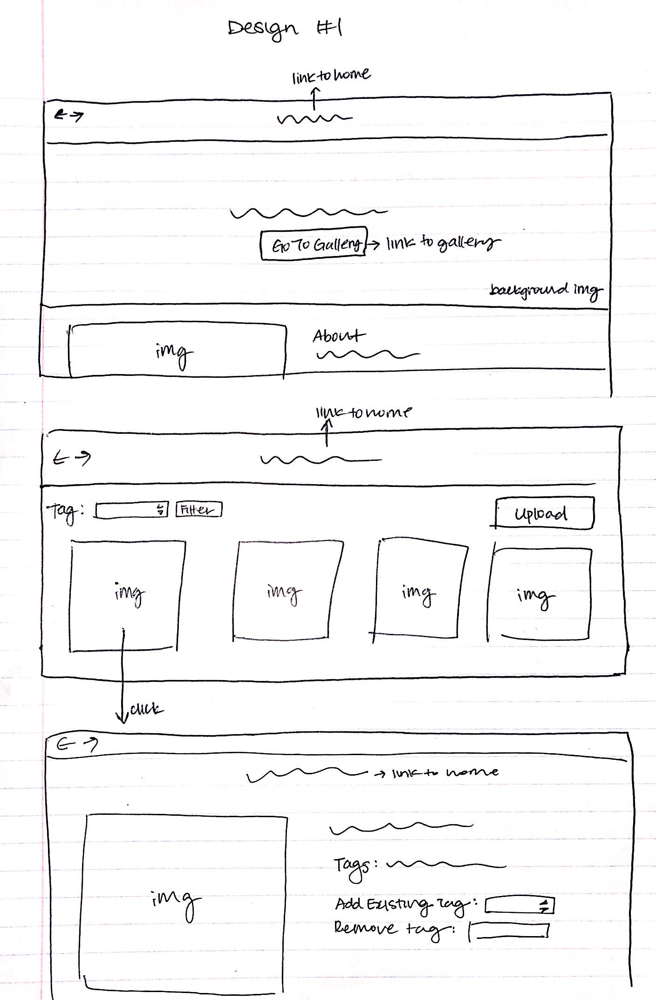
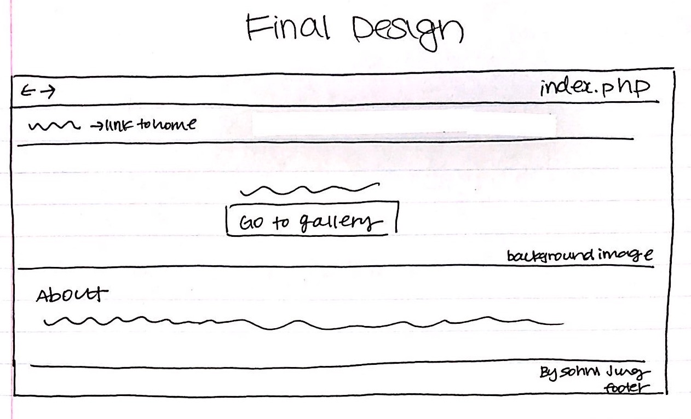
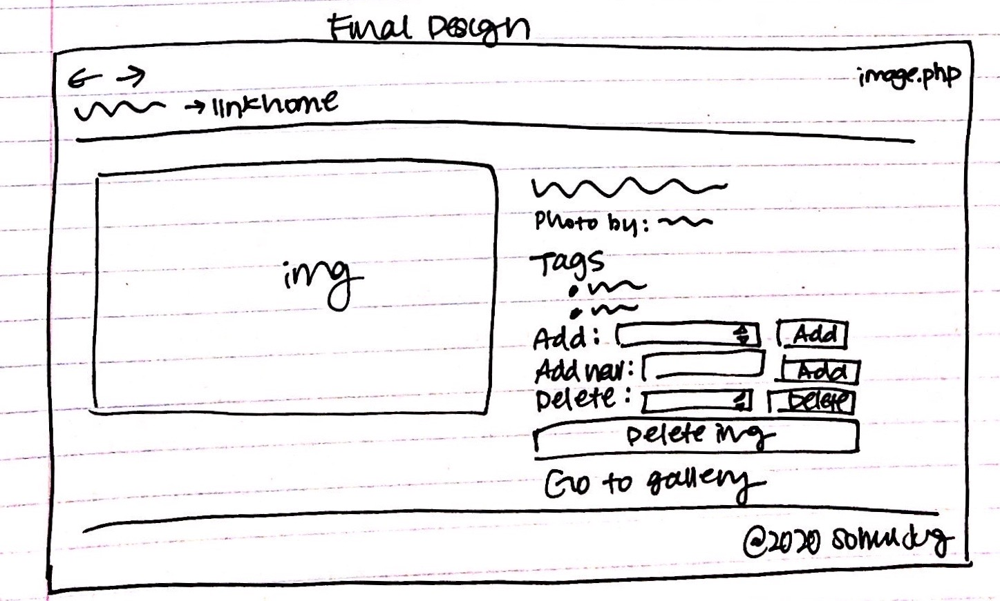

# Project 3: Design Journey

Be clear and concise in your writing. Bullets points are encouraged.

**Everything, including images, must be visible in VS Code's Markdown Preview.** If it's not visible in Markdown Preview, then we won't grade it.

# Design & Plan (Milestone 1)

## Describe your Gallery (Milestone 1)
> What will your gallery be about? 1 sentence.

My gallery will be about professional photography photos.

> Will you be using your existing Project 1 or Project 2 site for this project? If yes, which project?

No

> If using your existing Project 1 or Project 2, please upload sketches of your final design here.

N/A

## Target Audience(s) (Milestone 1)
> Tell us about your target audience(s).

My target audience includes, but is not limited to people who are trying to share and promote their ideas and works, people trying to draw inspiration about potential photo ideas, and people who love photography in general.

## Design Process (Milestone 1)
> Document your design process. Show us the evolution of your design from your first idea (sketch) to design you wish to implement (sketch). Show us the process you used to organize content and plan the navigation (card sorting), if applicable.
> Label all images. All labels must be visible in VS Code's Markdown Preview.
> Clearly label the final design.








After I realized that the filter and upload were too close in proximity, which would make it confusing for my users, I decided to move the uplaod form to the bottom. I also decided to add a "Gallery" link at the top that would allow for all pictures to be displayed. I found this to be necessary to allow users to go back to view the entire gallery from the filter. I also thought it made the most sense for the link "Blink" to be aligned with the "Gallery".

## Design Patterns (Milestone 1)
> Explain how your site leverages existing design patterns for image galleries.
> Identify the parts of your design that leverage existing design patterns and justify their usage.
> Most of your site should leverage existing patterns. If not, fully explain why your design is a special case (you need to have a very good reason here to receive full credit).

My gallery page also allows for vertically scrolling through the contents to view photos in the page. My page also allows for uploading images to the gallery by first pressing on the browse button to allow the user to choose an image they'd like to upload. Then, upon pressing "Upload," the image will either be added to the gallery or feedback will be given on why their upload did not succeed. To view details about an image, the user can click on an image in the main gallery. Then, one will come to a page with a larger image view and details about the image, such as its name and tags. Users can also delete images in this image details page by pressing on the delete button.

## Requests (Milestone 1)
> Identify and plan each request you will support in your design.
> List each request that you will need (e.g. view image details, view gallery, etc.)
> For each request, specify the request type (GET or POST), how you will initiate the request: (form or query string param URL), and the HTTP parameters necessary for the request.

Example:
- Request: view image details
  - Type: GET
  - Way of initiation: query string param URL
  - Params: id _or_ image_id
- Request: view image gallery upon filter
  - Type: GET
  - Way of initiation: query string param URL
  - Params: id _or_ filter_id
- Request: upload image
  - Type: POST
  - Way of initiation: form
  - Params: id, file_name, file_ext, file_source
- Request: remove image
  - Type: POST
  - Way of initiation: form
  - Params: id _or_ image_id
- Request: add tags
  - Type: POST
  - Way of initiation: form
  - Params: id, tag, image_tags
- Request: remove tags
  - Type: POST
  - Way of initiation: form
  - Params: id, tag, image_tags


## Database Schema Design (Milestone 1)
> Plan the structure of your database. You may use words or a picture.
> Make sure you include constraints for each field.

> Hint: You probably need `images`, `tags`, and `image_tags` tables.

> Hint: For foreign keys, use the singular name of the table + _id. For example: `image_id` and `tag_id` for the `image_tags` table.

```
images (
id : INTEGER {PK, U, Not, AI}
file_name: TEXT {Not}
file_ext : TEXT {Not}
file_source : TEXT {Not}
)
```

```
tags (
id : INTEGER {PK, U, Not, AI}
tag: TEXT {U, Not}
)
```

```
image_tags (
id : INTEGER {PK, U, Not, AI}
image_id: INTEGER {Not}
tag_id: INTEGER {Not}
)
```

## Database Query Plan (Milestone 1)
> Plan your database queries. You may use natural language, pseudocode, or SQL.
> Using your request plan above, plan all of the queries you need.

Select all images
```sql
SELECT * FROM images;
```

Select all tags
```sql
SELECT * FROM tags;
```

Add image to gallery
```sql
INSERT INTO images (file_name, file_ext, file_source) VALUES (:imageName, :imageExt, :fileSource);
```

Delete image from gallery
```sql
DELETE FROM images WHERE id = :imageId;
```

Add a tag to an image
```sql
INSERT INTO image_tags (image_id, tag_id) VALUES (:imageId, :addTagId);
```

Delete a tag
```sql
DELETE FROM image_tags WHERE id = :deleteTagId;
```

Display images by filter
```sql
SELECT id FROM tags WHERE tag = :selectedTag;
```

Select image_tags to delete
```sql
SELECT id FROM image_tags WHERE image_id = :imageId;
```

Delete image_tags between image and tag
```sql
DELETE FROM image_tags WHERE tag_id = :tagId;
```

## Code Planning (Milestone 1)
> Plan what top level PHP pages you'll need.

- index.php
  - link to gallery
  - explains purpose of website

- gallery.php
  - displays all the images
  - can add images
  - can display all filters
  - can filter based on tags

- image.php
  - display single image
  - display all tags for image
  - add/delete a tag
  - create/add existing tag
  - delete image

> Plan what partials you'll need.

* head.php
* header.php
* footer.php

All is repeated in every page, and will be included using php include.

> Plan any PHP code you'll need.

- For partials in every page
  - ```<?php include("includes/init.php"); ?>```
  - ```<?php include("includes/head.php"); ?>```
  - ```<?php include("includes/header.php"); ?>```
  - ```<?php include("includes/footer.php"); ?>```
- For image gallery
  - ```function display_gallery() { make path id and file ext, select/show name of image and its link to individual page from db }```
- For adding image
  - if (user uploads image with no error and all its inputs are escaped properly) then add to gallery ```sql(INSERT INTO images (file_name, file_ext, file_source) VALUES (:imageName, :imageExt, :imageSource);```
- For deleting image
  - if user clicks on delete button, then ```sql(DELETE FROM images WHERE id = :imageId;)``` and ```sql(DELETE FROM links WHERE image_id = :imageId;)```
- In forms
  - ```function show_options() { select distinct from db and display each as an option in form }```


# Complete & Polished Website (Final Submission)

## Gallery Step-by-Step Instructions (Final Submission)
> Write step-by-step instructions for the graders.
> For each set of instructions, assume the grader is starting from index.php.

Viewing all images in your gallery:
1. Click on "Go to gallery"

View all images for a tag:
1. Click on "Go to gallery"
2. Choose an option under "Filter by tag" and click on the "Filter" button

View a single image and all the tags for that image:
1. Click on "Go to gallery"
2. Click on any single image

How to upload a new image:
1. Click on "Go to gallery"
2. Click on the browse button displayed next to "Upload an image". Upon choosing an image, click on the "Upload" button

How to delete an image:
1. Click on "Go to gallery"
2. Click on any image
3. Click on "Delete Image" at the bottom right of the screen

How to view all tags at once:
1. Click on "Go to gallery"
2. View options next to filter by tag

How to add a tag to an existing image:
1. Click on "Go to gallery"
2. Click on an existing image

How to remove a tag from an existing image:
1. Click on "Go to gallery"
2. Click on an existing image
3. Choose an option from "Delete existing tag" and click on the "Delete" button


## Reflection (Final Submission)
> Take this time to reflect on what you learned during this assignment. How have you improved since starting this class?

In addition to being able to implement a filter, I learned how to be able to add images to a website by connecting to a database. I even learned how to have individual image pages displaying its details for a large number of images without hardcoding every single page by making use of query string parameters. I also worked with multiple tables at once even when not relying on SQLite for the first time to achieve this. This project was by far the most challenging project I've done for this class and its predecessor, but I'm having a fun time learning how to implement the most challenging things on a website that I use on a daily basis. It really helps me appreciate the websites out there, knowing how hard it is to implement these functionalities. I also think it's super cool to be able to know how to do program search bars, add images to a webpage, work with databases as a student!
